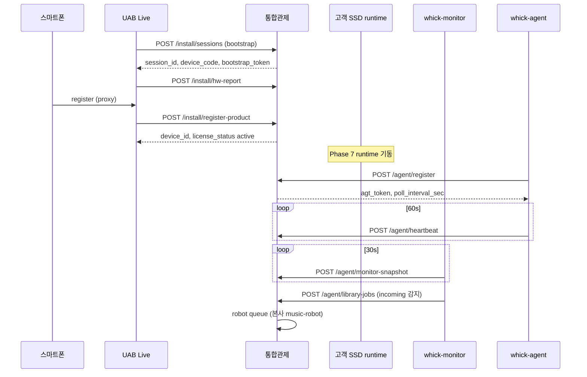

# 고객 뮤직서버 ↔ 통합관제(CC) 통신 규격 v1

**갱신:** 2026-06-08  
**SSOT:** 설치·등록·관제·음원 job — **동일 envelope**  
**연관:** [UAB-INSTALL-PROCESS.md](../../install/UAB-INSTALL-PROCESS.md) · [LICENSE-HW-BINDING.md](../../install/LICENSE-HW-BINDING.md) · [API-NEEDS.md](API-NEEDS.md)

---

## 1. Base URL · 인증

| 환경 | Base |
|------|------|
| 프로덕션 | `https://control.whick.org/api/v1` |
| 개발 | `http://127.0.0.1:8090/api/v1` |

| 단계 | 인증 | 헤더 |
|------|------|------|
| **설치 (UAB/bootstrap)** | `bst_<hex>` (세션 1회 발급) | `Authorization: Bearer bst_…` |
| **runtime (agent/monitor)** | `agt_<hex>` (`/agent/register` 후) | `Authorization: Bearer agt_…` |
| **관제 UI** | JWT | `Authorization: Bearer <jwt>` |

---

## 2. 공통 envelope

모든 **신규** device→CC 요청은 아래 래퍼를 권장. CC는 `envelope` 없이 `payload`만 보낸 **레거시**도 수용.

```json
{
  "protocol_version": "1.0.0",
  "message_id": "550e8400-e29b-41d4-a716-446655440000",
  "sent_at": "2026-06-08T12:00:00Z",
  "device_serial": "a1b2…64hex",
  "source": "agent",
  "type": "heartbeat",
  "payload": { }
}
```

| 필드 | 필수 | 설명 |
|------|------|------|
| `protocol_version` | ✅ | `"1.0.0"` |
| `message_id` | ✅ | UUID · **멱등** (중복 시 `duplicate: true`) |
| `source` | ✅ | `bootstrap` · `agent` · `monitor` |
| `type` | ✅ | 아래 표 |
| `payload` | ✅ | 타입별 본문 |

**응답 (공통):**

```json
{
  "ok": true,
  "data": { },
  "meta": null,
  "error": null
}
```

실패: `ok: false`, `error: { "code": "…", "message": "…" }`

구현: `3_product/protocol/envelope.mjs` · `cc-client.mjs`

---

## 3. 생명주기 — 설치 → 등록 → runtime



---

## 4. 설치 API (`source: bootstrap`)

| Method | Path | type | 상태 |
|--------|------|------|------|
| POST | `/install/sessions` | `install_session_create` | ✅ 초안 |
| GET | `/install/sessions/:id` | — | ✅ 초안 |
| POST | `/install/hw-report` | `hw_report` | ✅ 초안 |
| GET | `/install/sessions/:id/hw-result` | — | ✅ 초안 |
| POST | `/install/register-product` | `register_product` | ✅ 초안 |
| POST | `/install/consent` | — | ⏳ |
| POST | `/install/proceed-anyway` | — | ⏳ |
| POST | `/install/factory-bind` | — | ⏳ |
| POST | `/install/claim-device` | — | ⏳ |

### 4.1 POST `/install/sessions`

**요청 payload:**

```json
{
  "install_path": "diy",
  "software_version": "v0.0.1",
  "hostname_hint": "whick-mini-01"
}
```

**응답 data:**

```json
{
  "session_id": 42,
  "device_code": "MUSIC-7K3Q",
  "bootstrap_token": "bst_…",
  "expires_at": "2026-06-08T18:00:00Z"
}
```

### 4.2 POST `/install/hw-report`

```json
{
  "session_id": 42,
  "hw_id_hash": "64hex…",
  "fingerprint": {
    "dmi_product_uuid": "…",
    "board_serial": "…",
    "primary_mac": "…",
    "ssd_serial": "…"
  }
}
```

### 4.3 POST `/install/register-product`

고객등록 = 제품등록 **원자** — [LICENSE-HW-BINDING.md](../../install/LICENSE-HW-BINDING.md)

```json
{
  "session_id": 42,
  "mb_id": "customer01",
  "email": "owner@example.com",
  "phone": "010…",
  "server_name": "카페 1호기",
  "mode": "diy"
}
```

**응답:** `{ device_id, serial_no, license_status: "active", agent_register_hint: { device_serial } }`

성공 후 SSD runtime에서 `POST /agent/register` 시 **`device_serial` = `hw_id_hash`**.

### 5.0 POST `/agent/register` (사전 등록 필수)

**무단 등록 금지** — `install/register-product`(또는 관리자 사전 등록)로 `cc_devices`·`license_status=active`·HW registry가 준비된 뒤에만 토큰 발급.

**요청 payload:**

```json
{
  "device_serial": "64hex hw_id_hash",
  "reported_hash": "64hex (device_serial과 동일)",
  "mb_id": "bkhkorea@gmail.com",
  "hostname": "test-750XDA",
  "software_version": "v0.0.1"
}
```

| 검증 | 실패 code |
|------|-----------|
| `device_serial` 64hex | `VALIDATION` |
| 사전 등록 장비 존재 | `NOT_PRE_REGISTERED` |
| `license_status` = `active` | `LICENSE_NOT_ACTIVE` |
| HW registry / `hw_id_hash` 일치 | `HW_REGISTRY_MISMATCH` |

**응답:** `{ device_id, token, poll_interval_sec, policy_version }`

---

## 5. Runtime API (`source: agent` · `monitor`)

| Method | Path | source | type | 주기 |
|--------|------|--------|------|------|
| POST | `/agent/register` | agent | `register` | 1회 |
| POST | `/agent/heartbeat` | agent | `heartbeat` | 60s |
| POST | `/agent/monitor-snapshot` | monitor | `monitor_snapshot` | 30s |
| POST | `/agent/attest` | agent | `hw_attest` | ≥1/24h |
| GET | `/agent/policy` | agent | — | heartbeat 직후 |
| GET | `/agent/commands/poll` | agent | — | 60s |
| POST | `/agent/commands/result` | agent | — | 이벤트 |
| POST | `/agent/library-jobs` | monitor | `library_job_create` | 이벤트 |
| GET | `/agent/library-jobs/:job_id` | monitor | — | poll |

### 5.1 POST `/agent/monitor-snapshot`

```json
{
  "health": "normal",
  "uptime_sec": 86400,
  "runtime": {
    "compose_project": "whick-runtime",
    "services": {
      "whick-agent": "running",
      "whick-audio": "running",
      "whick-monitor": "running"
    }
  },
  "metrics": {
    "cpu_pct": 12.5,
    "mem_pct": 48.0,
    "disk_pct": 33.0
  },
  "library": {
    "incoming_path": "/var/lib/whick/library/incoming",
    "pending_files": 3,
    "last_scan_at": "2026-06-08T11:59:00Z"
  }
}
```

### 5.2 POST `/agent/library-jobs`

관제담당 → CC → 본사 `robots/music` 매칭.

```json
{
  "job_type": "scan",
  "source_path": "/var/lib/whick/library/incoming",
  "files": [
    { "rel_path": "album/track01.flac", "size_bytes": 45000000, "mtime": "…" }
  ]
}
```

**응답:** `{ job_id, status: "queued", robot_target: "robot-auditor" }`

**검수 완료 result (robot-auditor — 파일 변경 없음):**

```json
{
  "mode": "audit_only",
  "files_modified": false,
  "approved": 2,
  "rejected": 1,
  "reviewed_files": ["album/a.flac"],
  "rejected_files": ["album/b.mp3"],
  "items": [
    { "rel_path": "album/a.flac", "verdict": "approved", "tier": "hires-rate" },
    { "rel_path": "album/b.mp3", "verdict": "rejected", "reasons": ["lossy_format"] }
  ],
  "robot": "robot-auditor"
}
```

**플레이어 후속 (사용자 승인 필수):**

| POST | Body | 설명 |
|------|------|------|
| `/api/library/import-incoming` | `{ "user_approved": true, "approved_paths": ["…"] }` | 승인 파일만 library로 이동 |
| `/api/library/delete-incoming` | `{ "user_approved": true, "paths": ["…"] }` | 사용자 허락 시에만 삭제 |

### 5.3 GET `/agent/library-jobs/:job_id`

```json
{
  "job_id": "…",
  "status": "completed",
  "result": {
    "approved": 2,
    "rejected": 1,
    "category_summary": { }
  }
}
```

---

## 6. 본사 로봇 API (JWT · staff)

| Method | Path | 설명 |
|--------|------|------|
| GET | `/music-servers/library-jobs/queue` | `status=queued` job 목록 |
| POST | `/music-servers/library-jobs/:job_id/claim` | robot-auditor claim |
| POST | `/music-servers/library-jobs/:job_id/result` | scan/review 결과 |

---

## 7. `device_serial` · `hw_id_hash` 정렬

| 필드 | 설치 | runtime |
|------|------|---------|
| `hw_id_hash` | hw-report · register-product | attest 비교 |
| `cc_devices.serial_no` | = `hw_id_hash` | register 시 `device_serial` |
| `device_code` | UI 표시 `MUSIC-xxxx` | install session만 |

---

## 8. 구현 매핑

| 컴포넌트 | 경로 |
|----------|------|
| 프로토콜 lib | `3_product/protocol/` |
| 관제담당 | `3_product/monitor/` |
| CC API | `whick-ai/2_control_center/api/src/routes/install.js` · `agent.js` · `musicServers.js` |
| DB | `2_control_center/db/09-install-monitor-library.sql` |

---

## 9. 에러 코드 (공통)

| code | HTTP | 의미 |
|------|------|------|
| `VALIDATION` | 400 | 필드 누락 |
| `SESSION_NOT_FOUND` | 404 | install session |
| `HW_ALREADY_BOUND` | 409 | 타 고객 HW |
| `LICENSE_SLOT_EXHAUSTED` | 409 | entitlement 없음 |
| `AGENT_AUTH_INVALID` | 401 | agt 토큰 |
| `BOOTSTRAP_AUTH_INVALID` | 401 | bst 토큰 |
| `DUPLICATE_MESSAGE` | 200 | message_id 중복 (멱등) |
