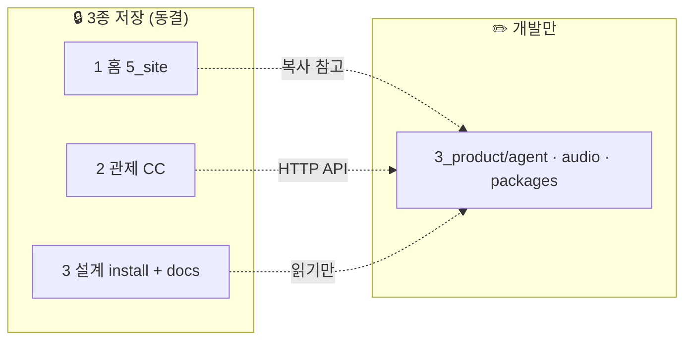

# 개발 구역 · Phase 0 기준선 (3종 저장)

**갱신:** 2026-06-08  
**한 줄:** 지금까지 만든 **3종은 저장(동결)** · 이후 코드는 **`3_product` 구현만** 추가.

---

## Phase 0에서 만든 것

**큰 카테고리:** 고객 **Whick 뮤직서버 제품** — 설계 · 폴더 · 격리 규칙 · Ubuntu 26.04 · USB 순서까지 **기준선 확정**.

---

## 3종 저장 — **건드리지 않음** 🔒

| 종 | 이름 | 경로 | 포함 | 금지 |
|----|------|------|------|------|
| **1** | **홈·체험 (운영)** | `5_site/` · `music-server/` | whick.org · trial · YouTube OAuth · theme | ❌ 수정 · ❌ 리팩터 |
| **2** | **통합관제** | `/data/whick-ai/2_control_center/` | API · UI · devices · agent | ❌ 수정 (API **호출**만) |
| **3** | **제품 설계 SSOT** | `install/` · `3_product/docs/` · `3_product/README.md` · `compose.yaml` · `.env.example` · `bootstrap/manifest.yaml` | UAB · 라이선스 · SCOPE · ISOLATION · 26.04 · USB 순서 | ❌ 설계 변경 (버그fix도 **별도 지시**) |

**1·2·3 = “저장본”.** 복사·참고만. symlink로 묶지 않음.

---

## 개발 구역 — **여기만 작업** ✏️

| 경로 | 내용 |
|------|------|
| **`3_product/agent/`** | whick-agent · CC · remote_cmd |
| **`3_product/audio/`** | CamillaDSP · ALSA |
| **`3_product/packages/`** | 판매 제품 전용 JS (다른 UI와 복사·동기화 금지) |
| **`3_product/remote/`** | 스마트폰 API · claim |
| **`3_product/library/`** · **`local-ai/`** · **`updater/`** | 필요 시 **신규** 추가 |

**하지 않음:** `5_site` · `2_control_center` · `install/` · **`3_product/docs/`** · 루트 `compose.yaml` **구조 변경** (서비스 추가는 agent/audio README에 메모 후 compose **최소 diff**만 — 설계 doc 수정 ❌)

---

## 흐름



---

## Cursor · AI 규칙

1. 커밋/작업 diff에 **1·2·3 경로 없음**이 정상  
2. 규칙: [ISOLATION.md](ISOLATION.md) · [`.cursor/rules/03-product-isolation.mdc`](../../.cursor/rules/03-product-isolation.mdc)  
3. 관제 API 부족 → [API-NEEDS.md](API-NEEDS.md)에만 기록  

---

## 다음 개발 (Phase 1)

**MVP:** `3_product/agent` + `3_product/audio` · compose로 dev 1대 · CC register · remote play/pause.

USB(`install/bootstrap/`) · 관제 스키마 · 홈 UI → **Phase 0 설계대로 나중**.

---

## 검증

```bash
# Phase 1 작업 후 — 동결 구역 변경 없어야 함
git diff --name-only -- 5_site/ install/ 3_product/docs/ 3_product/README.md 3_product/compose.yaml
# (music-server · whick-ai/2_control_center 는 워크스페이스 밖이면 수동 확인)
```
