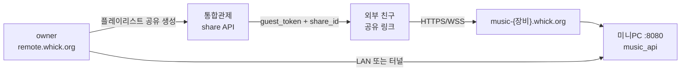

# 플레이리스트 공유 (SSOT · 예정)

**갱신:** 2026-06-18  
**상태:** ⏳ **미구현** — 프로젝트관제 **Whick 뮤직서버 → 플레이리스트 공유** 항목으로 추적  
**선행:** [REMOTE-DESIGN.md](REMOTE-DESIGN.md) · [REMOTE-PORTAL.md](REMOTE-PORTAL.md) · 장비별 터널 · `device_token`

---

## 1. 목적

| | |
|--|--|
| **무엇** | owner가 만든 **플레이리스트**를 **외부 친구**에게 링크·초대로 공유 |
| **친구가 할 수 있는 것** | 공유된 목록 **청취·재생 조절** (범위는 정책 TBD) |
| **친구가 할 수 없는 것** | 설치·설정·전체 라이브러리·HW/라이선스 (가족 remote·owner와 구분) |

가족 **remote**([../../install/DEVICE-HOUSEHOLD-REMOTE.md](../../install/DEVICE-HOUSEHOLD-REMOTE.md))는 Whick **회원**·**리모컨 전용**.  
플레이리스트 공유는 **비회원·게스트** 또는 **약한 권한 토큰** 대상으로 **별 기능**.

---

## 2. 프로젝트관제

| 필드 | 값 |
|------|-----|
| **프로젝트** | Whick 뮤직서버 (`music-server`) |
| **항목** | 플레이리스트 공유 |
| **의존** | 리모컨·bridge · agent · **장비별 터널** · `music_api` |

---

## 3. 아키텍처 (목표)

| 구간 | 비고 |
|------|------|
| **포털** `remote.whick.org` | owner·가족 로그인 (✅) |
| **장비 터널** | Wi-Fi 밖에서 친구·owner 모두 필요 (⏳) |
| **게스트 진입** | 전용 URL 예: `remote.whick.org/share/{token}` 또는 `https://music-xxxx.whick.org/share/...` (⏳) |

---

## 4. 권한 모델 (초안)

| 역할 | 계정 | 플레이리스트 | 재생 | 설정·설치 |
|------|------|-------------|------|-----------|
| **owner** | whick.org Lv3+ | CRUD | ✅ | ✅ |
| **family remote** | whick.org Lv2+ | 열람·재생 | ✅ | ❌ |
| **guest (공유)** | **불필요** (링크+토큰) | **공유분만** | ✅ (allowlist) | ❌ |

**GUEST_ALLOWLIST (예정):**

| action | guest |
|--------|-------|
| `play`, `pause`, `next`, `prev`, `volume` | ✅ (공유 큐 내) |
| `library_browse`, `queue_add` (전체) | ❌ |
| `settings_*`, `share_*`, `member_*` | ❌ |

---

## 5. API · 데이터 (예정)

Base: 통합관제 `/api/v1` · 미니PC `music_api` 연동

| Method | Path | 권한 | 설명 |
|--------|------|------|------|
| POST | `/devices/:id/playlist-shares` | owner | `{ playlist_id, expires_in?, max_plays? }` |
| GET | `/playlist-shares/:token` | guest | 공유 메타·트랙 목록 (마스킹) |
| DELETE | `/devices/:id/playlist-shares/:shareId` | owner | 공유 revoke |
| POST | `/playlist-shares/:token/accept` | guest | (선택) 수신 확인·통계 |

**DB (예정):** `cc_playlist_shares` — `device_id`, `playlist_ref`, `token_hash`, `expires_at`, `revoked_at`, `created_by`

**미니PC:** 공유 큐 전용 endpoint 또는 WS `play_shared` + `guest_token` 검증 (CC 위임 또는 device 서명 JWT).

---

## 6. 선행 작업 (리모컨과 공통)

| # | 항목 | 상태 |
|---|------|------|
| 1 | 장비별 Cloudflare tunnel → `tunnel_host` meta | ⏳ |
| 2 | agent + `music_api` `:8080` runtime | ⏳ |
| 3 | owner `device_token` (폰→미니PC) | ⏳ |
| 4 | v4 리모컨 UI 포털 embed | ⏳ |
| 5 | **플레이리스트 공유** (본 문서) | ⏳ |

---

## 7. UX (초안)

| 화면 | owner | guest |
|------|-------|-------|
| 리모컨 · 플레이리스트 | 「공유」→ 링크·QR·만료 | — |
| 공유 링크 열기 | — | Whick 브랜드 **경량 플레이어** (로그인 없음) |
| 만료/취소 | 「공유 중단」 | 「링크가 만료되었습니다」 |

친구에게는 **whick.org 가입 필수 아님** (정책 확정 시 `선택 가입` 가능).

---

## 8. 보안 · 정책 (TBD)

- 공유 링크 **추측 불가** token (≥128bit)
- **HTTPS/WSS** 필수 (장비 터널)
- rate limit · 동시 접속 상한
- 저작권·개인 음원 — **owner 책임** 고지 (whick.org 약관 연계)
- 공유 범위: **플레이리스트 단위** (단일 곡만은 후순위)

---

## 9. 구현 순서 (제안)

1. `cc_playlist_shares` migration + owner CRUD API  
2. 게스트 read-only player (remote 포털 또는 경량 `/share`)  
3. `music_api` guest_token 검증 + 공유 큐 재생  
4. owner UI (v4 리모컨 또는 whick.org)  
5. 통계·revoke·알림 (선택)

---

## 10. 관련 문서

- [REMOTE-DESIGN.md](REMOTE-DESIGN.md) — 재생 프로토콜
- [REMOTE-PORTAL.md](REMOTE-PORTAL.md) — `remote.whick.org`
- [../../install/DEVICE-HOUSEHOLD-REMOTE.md](../../install/DEVICE-HOUSEHOLD-REMOTE.md) — 가족 remote vs guest
- [../../docs/CUSTOMER-INSTALL-PLAN.md](../../docs/CUSTOMER-INSTALL-PLAN.md) — Bootstrap·터널
