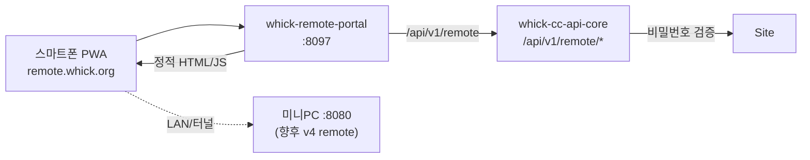

# Whick Remote Portal — 독립 도메인 (SSOT)

**갱신:** 2026-06-18  
**URL:** `https://remote.whick.org`  
**코드:** `3_product/packages/remote-portal/`  
**리모컨 UI (v4):** `3_product/packages/remote/` — 포털에 **후속 연동**

---

## 1. 왜 별도 도메인?

| 요구 | 대응 |
|------|------|
| whick.org 홈·체험과 분리 | `remote.whick.org` 전용 PWA |
| 홈 없이 리모컨만 | 포털 첫 화면 = **로그인** |
| 스마트폰 북마크·홈화면 | `manifest.webmanifest` · standalone |

체험 리모컨(`whick.org/pages/spatial-remote.php`)과 **URL·인증·프로토콜 모두 분리**.

---

## 2. 아키텍처

---

## 3. 인증 흐름

1. 사용자 → `POST /api/v1/remote/auth/login` `{ login, password }`
2. CC → whick.org `verify-login.php` (Lv**2**+, 가족 remote 허용)
3. CC → JWT `aud: whick-remote` (기본 30일)

**통합관제 JWT와 분리** — staff 토큰으로 리모컨 API 사용 불가.

---

## 4. API (CC core, public)

| Method | Path | 설명 |
|--------|------|------|
| POST | `/api/v1/remote/auth/login` | Whick 계정 로그인 |
| GET | `/api/v1/remote/auth/me` | Bearer 검증 |
| GET | `/api/v1/remote/devices` | 내 장비 목록 |

구현: `2_control_center/api/src/routes/remotePortal.js`

---

## 5. 배포

| 단계 | 명령 |
|------|------|
| 포털 빌드 | `3_product/packages/remote-portal/scripts/deploy-remote-portal.sh` |
| CC API | `remotePortal` 라우트 포함 후 `whick-cc-api-core` restart |
| Tunnel | `0_gateway/cloudflare/config.yml` → `remote.whick.org` → `:8097` |
| DNS | Cloudflare CNAME `remote` → `f6ffa87b-….cfargotunnel.com` (Proxied) |
| 반영 | `sudo /data/whick-ai/0_gateway/scripts/sync-tunnel-config.sh` |

로컬 확인: `http://127.0.0.1:8097`

---

## 6. 구현 상태

| 항목 | 상태 |
|------|------|
| 독립 도메인·nginx·docker | ✅ 준비 |
| PWA 아이콘·manifest·SW | ✅ (홈·CC 스타일 steampunk 리모컨) |
| 로그인·장비 목록 | ✅ |
| v4 리모컨 UI embed | ✅ packages/remote → portal iframe |
| incoming 검수 UI | ✅ user_approved import/delete |
| device_token (player) | ✅ meta + player token file |
| cc_device_members | ✅ db/73 + invite/accept/revoke API |
| **유튜브 · 외부 스트리밍** | **2차 제외** — [REMOTE-PHASE1-SCOPE.md](REMOTE-PHASE1-SCOPE.md) |
| **플레이리스트 공유** (외부 친구) | ⏳ 2차 [PLAYLIST-SHARE.md](PLAYLIST-SHARE.md) |
| 가족 초대 UI (whick.org) | ⏳ API만 · owner UI 후속 |

---

## 7. 관련 문서

- [REMOTE-DESIGN.md](REMOTE-DESIGN.md) — v4 프로토콜·화면
- [../../install/DEVICE-HOUSEHOLD-REMOTE.md](../../install/DEVICE-HOUSEHOLD-REMOTE.md) — owner/remote 역할
- [../../docs/DOMAIN-MIGRATION.md](../../docs/DOMAIN-MIGRATION.md) — DNS SSOT
